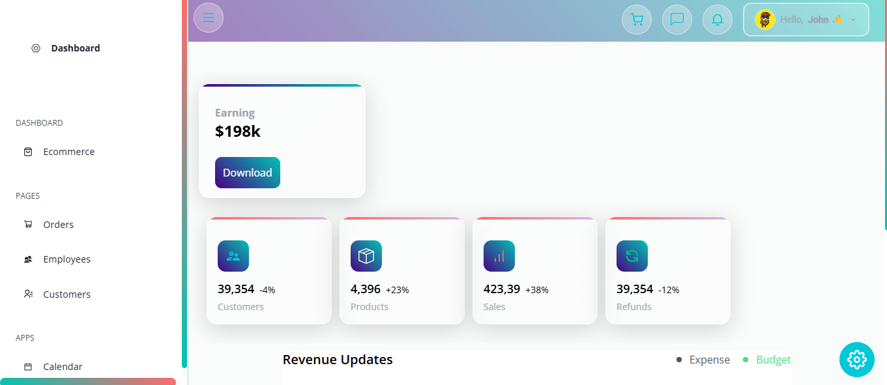

eCommerce Dashboard
A modern, responsive eCommerce dashboard built with React, Tailwind CSS, and Syncfusion components. The dashboard provides an overview of key metrics such as earnings, customers, products, sales, and refunds, along with revenue updates and interactive charts. It features a dynamic sidebar, theme settings, and a user profile panel that slides in from the right.
Features

Dashboard Overview:
Displays key metrics in cards: Earning, Customers, Products, Sales, and Refunds.
Revenue updates with budget and expense tracking.
Interactive charts (Stacked, Sparkline) for data visualization.

Responsive Design:
Adapts to various screen sizes, with a collapsible sidebar on mobile.
Cards adjust dynamically to fit in a single row on desktop.

User Profile:
Accessible via the "Hello John" button in the navbar.
Slides in from the right with a close button.

Theme Customization:
Toggle between light and dark modes.
Customizable colors via a settings panel.

Navigation:
Sidebar with links to pages like Orders, Employees, Customers, Kanban, Calendar, and various charts (Line, Area, Bar, Pie, etc.).
Navbar with quick access to Cart, Chat, Notifications, and User Profile.

Interactive Components:
Syncfusion components for dropdowns, tooltips, and charts.
Buttons with hover effects and dynamic styling.

## Screenshots

Technologies Used

Frontend: React, React Router, React Icons
Styling: Tailwind CSS, Syncfusion EJ2 React Components
State Management: React Context API (via ContextProvider)
Data: Dummy data from data/dummy.js
Others: Vite (or Create React App, depending on your setup)

Project Structure
ecommerce-dashboard/
├── public/
│   ├── index.html
│   └── assets/
├── src/
│   ├── components/
│   │   ├── Navbar.jsx
│   │   ├── Sidebar.jsx
│   │   ├── ThemeSettings.jsx
│   │   ├── Button.jsx
│   │   ├── SparkLine.jsx
│   │   ├── Stacked.jsx
│   │   ├── Cart.jsx
│   │   ├── Chat.jsx
│   │   ├── Notification.jsx
│   │   ├── UserProfile.jsx
│   │   └── ...
│   ├── contexts/
│   │   └── ContextProvider.js
│   ├── data/
│   │   └── dummy.js
│   ├── pages/
│   │   ├── Ecommerce.jsx
│   │   ├── Orders.jsx
│   │   ├── Employees.jsx
│   │   ├── Customers.jsx
│   │   ├── Kanban.jsx
│   │   ├── Calendar.jsx
│   │   ├── ColorPicker.jsx
│   │   ├── Editor.jsx
│   │   ├── Line.jsx
│   │   ├── Area.jsx
│   │   ├── Bar.jsx
│   │   ├── Pie.jsx
│   │   ├── Financial.jsx
│   │   ├── ColorMapping.jsx
│   │   ├── Pyramid.jsx
│   │   ├── Stacked.jsx
│   │   └── ...
│   ├── App.jsx
│   ├── App.css
│   ├── index.jsx
│   └── main.jsx
├── package.json
├── vite.config.js (or equivalent)
└── README.md

Prerequisites

Node.js (v16 or higher)
npm or Yarn
Git

Setup and Installation

Clone the Repository:
git clone https://github.com/johnkoshy/Ecommerce-Application-React.git
cd Ecommerce-Application-React

Install Dependencies:
npm install

or
yarn install

Run the Development Server:
npm run dev

or
yarn dev

Open http://localhost:5173 (or the port specified) in your browser.

Build for Production:
npm run build

or
yarn build

Usage

Navigate the Dashboard:
Access the main dashboard at / or /ecommerce.
Use the sidebar to navigate to other pages (e.g., Orders, Customers, Charts).

Interact with Features:
Click the "Hello John" button in the navbar to open the User Profile panel.
Toggle theme settings via the settings button (bottom-right).
View metrics and charts on the dashboard.

Customize:
Update data/dummy.js to modify dashboard data (e.g., earningData for cards).
Adjust Tailwind classes or App.css for styling.
Extend ContextProvider.js for additional state management.

