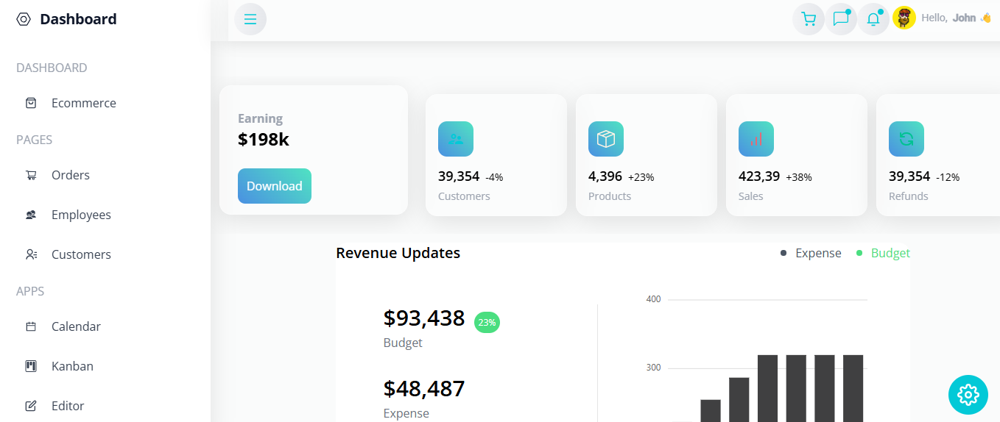

# eCommerce Dashboard

A modern, responsive eCommerce dashboard built with React, Tailwind CSS, and Syncfusion components. Features key metrics (earnings, customers, products, sales, refunds), interactive charts, a dynamic sidebar, theme settings, and a user profile panel.

[](https://opensource.org/licenses/MIT)

## Table of Contents
- [Features](#features)
- [Screenshots](#screenshots)
- [Requirements](#requirements)
- [Setup](#setup)
- [Usage](#usage)
- [Project Structure](#project_structure)
- [Technologies](#technologies)
- [Contributing](#contributing)
- [License](#license)

## Features
- **Dashboard Overview**: Displays metrics (Earning, Customers, Products, Sales, Refunds) in cards, with revenue updates and interactive charts (Stacked, Sparkline).
- **Responsive Design**: Adapts to all screen sizes, with a collapsible sidebar on mobile.
- **User Profile**: Accessible via the navbar, slides in from the right with a close button.
- **Theme Customization**: Toggle light/dark modes and customize colors via a settings panel.
- **Navigation**: Sidebar links to Orders, Employees, Customers, Kanban, Calendar, and various charts (Line, Area, Bar, Pie, etc.).
- **Interactive Components**: Syncfusion dropdowns, tooltips, and charts with dynamic button styling.

## Screenshots
| Dashboard |
|-----------|
|  |

## Requirements
- Node.js (v16 or higher)
- npm or Yarn
- Git
- Web browser (e.g., Chrome, Firefox, Edge)

## Setup
1. Clone the repository:
   ```bash
   git clone https://github.com/johnkoshy/Ecommerce-Application-React.git
   cd Ecommerce-Application-React
   ```
2. Install dependencies:
   ```bash
   npm install
   # or
   yarn install
   ```
3. Run the development server:
   ```bash
   npm run dev
   # or
   yarn dev
   ```
   - Open `http://localhost:5173` (or the specified port) in your browser.
4. Build for production (optional):
   ```bash
   npm run build
   # or
   yarn build
   ```

## Usage
1. Access the dashboard at `http://localhost:5173` or `/ecommerce`.
2. Use the **Sidebar** to navigate to pages like Orders, Customers, or Charts.
3. Click **Hello John** in the navbar to open the User Profile panel.
4. Toggle **Theme Settings** (bottom-right) to switch between light/dark modes or adjust colors.
5. Explore metrics and interact with charts on the dashboard.

## Project Structure
- **public/**:
  - **index.html**: Main HTML entry point.
  - **assets/**: Static assets (e.g., images).
- **src/**:
  - **components/**: Reusable components (e.g., `Navbar.jsx`, `Sidebar.jsx`, `SparkLine.jsx`).
  - **contexts/**: `ContextProvider.js` for state management.
  - **data/**: `dummy.js` for mock data.
  - **pages/**: Page components (e.g., `Ecommerce.jsx`, `Orders.jsx`, `Line.jsx`).
  - **App.jsx**: Main app component.
  - **index.jsx**/**main.jsx**: React entry points.
  - **App.css**: Global styles.
- **package.json**: Project dependencies and scripts.
- **vite.config.js**: Vite configuration (if using Vite).

## Technologies
- **React**: Frontend framework with React Router and React Icons.
- **Tailwind CSS**: Utility-first CSS framework.
- **Syncfusion EJ2 React**: Components for charts, dropdowns, and tooltips.
- **React Context API**: State management via `ContextProvider`.
- **Vite**: Build tool (or Create React App, if applicable).

## Contributing
Contributions are welcome! 🎉 For issues, suggestions, or improvements, please open an issue or submit a pull request on [GitHub](https://github.com/johnkoshy/Ecommerce-Application-React/issues). To customize, update `data/dummy.js` for data or modify Tailwind classes in components.

## License
This project is licensed under the [MIT License](LICENSE).